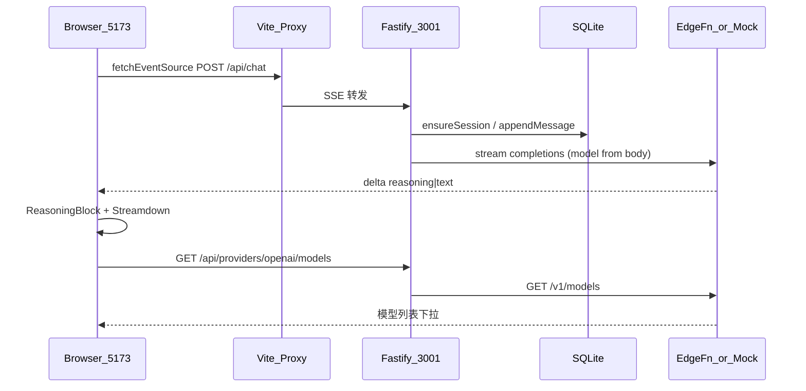
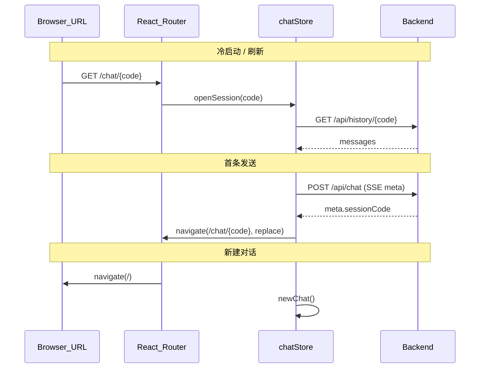
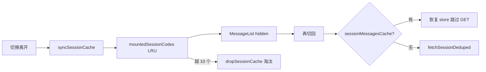

# XX Chat AI — 全栈 AI 聊天方案

> **项目名称**：**XX Chat AI**  
>
> - **GitHub 仓库名**：`xx-chat-ai`（小写 + 连字符，历史仓库名保留）  
> - **XX** — 品牌字符  
> - **Chat** — AI 聊天  
> - **AI** — 大模型对话  
> - 副标题 / README：`Full-Stack AI Chat`（体现前后端全栈）
>
> **样式栈**：shadcn/ui + Tailwind CSS 4 + next-themes

**当前状态**：Phase 6（加载骨架屏与会话体验优化）已落地，可 `pnpm dev` 验收。

---

## 1. 项目目标

**用户纯文本输入 → SSE 流式推送 → 累加 content / reasoning → 多格式渲染 → 可停止 → 历史对话 → Mock/OpenAI 切换 → 动态选模型**

硬性约束：前端 **React + `@microsoft/fetch-event-source`**。

### 范围（已做 / 不做）

| 已做 | 不做 |
| --- | --- |
| 纯文本输入、SSE 流式、停止生成 | Typewriter 打字机效果 |
| GFM 表格 / 代码 / 图片 / Mermaid / KaTeX 公式 | 多模态上传 |
| 推理块展示（`ReasoningBlock` 折叠） | tool / citation 结构化片段 |
| Mock 关键词意图 + OpenAI 兼容端点 | 代码块全屏（Streamdown 不支持） |
| SQLite 历史 + 侧栏对话列表 | — |
| 图片点击放大预览（自研 Lightbox） | Streamdown 原生图片全屏（不支持） |
| 动态拉取供应商模型列表 | — |
| 用户消息编辑回填输入框 | — |
| URL 会话路由 `/` + `/chat/:sessionCode` | 会话分享鉴权、公开链接权限控制 |
| 加载骨架屏（聊天区 + 历史列表） | — |
| 会话 Keep-Alive + 内存消息缓存（切换免重复请求） | — |
| 同会话同文案同模型 SSE 回放（不调大模型） | — |

---

## 2. 技术决策

| 项 | 选择 |
| --- | --- |
| **项目名称** | **XX Chat AI**（GitHub：`xx-chat-ai`，目录 `Interview/xx-chat-ai/`） |
| 定位 | **全栈 AI 聊天** — React 前端 + Fastify 后端 + LLM 流式对话 |
| 结构 | pnpm workspace：`apps/web` + `apps/server` |
| 前端 | Vite 8 + React 19 + TypeScript 6 |
| 后端 | Fastify 5 + TypeScript |
| SSE | `@microsoft/fetch-event-source` + AbortController |
| 状态 | Zustand 5 + persist（`provider` / `model`） |
| Markdown | Streamdown + `@streamdown/code` + `@streamdown/mermaid` + `@streamdown/math` + `@streamdown/cjk` |
| **样式栈** | shadcn/ui + Tailwind CSS 4（`@tailwindcss/vite`） |
| **UI 组件** | shadcn CLI → `components/ui/*`（Button、Input、Sidebar、DropdownMenu、Tooltip…） |
| **图标** | lucide-react；操作图标 18px、发送/停止图标 20px（`size-5`） |
| **主题** | 官网 **Maia + Neutral** preset `b6iJYxYW` + `next-themes` |
| **字体** | Source Sans 3 Variable（init 后实际使用，非 Inter） |
| **视觉** | 简约对话风；全页 `bg-background`；大圆角 `--radius: 1rem` |
| Provider | `DropdownMenu` 切换 Mock / OpenAI（已移除 Switch） |
| 模型 | Header `ModelMenu` 动态下拉（`GET /api/providers/openai/models`） |
| 大模型 | `openai` SDK 流式代理 OpenAI API（兼容协议，可接 edgefn、DeepSeek 等）；配置见 `config.local.json`（gitignore） |
| 存储 | **better-sqlite3**（`apps/server/data/chat.db`，WAL） |
| 运行 | 本地 `pnpm dev`（:5173 + :3001） |
| 路由（Phase 5） | **react-router-dom**；`/` 新对话、`/chat/:sessionCode` 已有对话 |

### 明确不做（视觉层）

- 自定义 `gemini.css` / gradient 光斑 / GlassPanel
- 自定义 `@theme` 覆盖 shadcn 色板
- 额外 UI 库（Ant Design、MUI 等）

### shadcn 初始化（已执行）

```bash
cd apps/web
npx shadcn@latest init -t vite -b radix -p b6iJYxYW -y
npx shadcn@latest add button input scroll-area sidebar separator skeleton sheet tooltip dropdown-menu
pnpm add next-themes streamdown @streamdown/code @streamdown/mermaid @streamdown/cjk
```

### 圆角规范（大圆角 · 用户指定）

| Token / 区域 | 值 |
| --- | --- |
| `--radius`（根） | `1rem` |
| Button / Input | `rounded-lg` |
| Streamdown 块级卡片（代码/表格/图片/Mermaid） | 统一 `rounded-lg`（`--radius-lg`） |
| 聊天输入外容器 | 胶囊形 `rounded-full` |
| 发送/停止按钮 | 圆形 `rounded-full`（`size-9`） |
| 停止图标 | 实心圆角小方块 `<span class="size-3.5 rounded-[4px] bg-current" />` |

### 样式抽离约定（`.cursor/rules/ui-styling.mdc`）

- 优先 shadcn 默认 `variant` / `size`，非必要不覆盖原语
- 长 Tailwind class 抽到同级 `ComponentName.styles.ts`：`export const styles = { … } as const`
- 条件样式用 `cn(styles.base, cond && styles.variant)`
- 不用 `@apply` 覆盖 shadcn 原语
- **单位**：固定布局常量用 `px`（侧栏宽 `280px`、页面最小宽 `320px`、发丝线/阴影模糊）；间距字号圆角等用 `rem` / Tailwind spacing

### 布局尺寸（固定常量）

| 项 | 值 |
| --- | --- |
| 页面最小宽 | `320px`（`#root` / `SidebarProvider`） |
| 宽屏侧栏宽 | `280px`（`--sidebar-width`） |
| 移动端抽屉宽 | `max(320px, min(360px, calc(100vw - 40px)))` |
| 窄屏断点 | `768px`（Tailwind `md`；`useIsMobile` 用 `matchMedia` + `useSyncExternalStore` 与 CSS 对齐） |

---

## 3. UI 布局（已实现）

```
┌─ Sidebar(280px) ┬─ 主区域 ───────────────────────────────────┐
│ 🐾 XX Chat AI   │ [≡][✎]                    [模型▾][Mock▾] [🌓] │
│ [新建对话]      ├──────────────────────────────────────────────┤
│ 历史对话列表    │   切换/刷新：全局骨架蒙层 → 内容淡入          │
│ (hover 删除 / 批量管理) │ Keep-Alive 多会话面板（隐藏不卸载）        │
│ 列表加载：10 条 h-10 骨架 │ 空状态：居中「嘻嘻，想问点什么？」+ 快捷标签 │
│                 │   有对话：用户右对齐气泡 / AI 全宽 Streamdown    │
│                 │          推理中：ReasoningBlock（扫光）+ ThreeDots │
│                 │                                              │
│                 │   ╭──────────────────────────────────────╮   │
│                 │   │  嘻嘻，想问点什么？              ( ↑ )    │   │
│                 │   ╰──────────────────────────────────────╯   │
│                 │   底部渐变过渡 + 悬浮输入区                    │
└─────────────────┴──────────────────────────────────────────────┘
```

| 区域 | 实现 |
| --- | --- |
| 侧栏 | `AppSidebar` + shadcn `Sidebar`（offcanvas，宽 `280px`）；顶部品牌（`PawPrint` 方标 +「XX Chat AI」`text-xl`）；「新建对话」；历史对话列表（`sessionsLoading` + `useDeferredSkeleton` 延时淡出）；标题行固定 `h-10` + 批量按钮占位槽；批量选择与删除；`TooltipProvider` 包裹（必须，否则白屏） |
| 顶栏 | `ChatHeader`：左 `SidebarTrigger` + 新建对话；右 `ModelMenu` + `ProviderMenu` + `ModeToggle`（左右 `gap-2`） |
| 空状态 | `HomeView`：居中标题 + `ChatComposer` + 快捷标签 |
| 用户消息 | 右对齐 `bg-muted` 圆角气泡（`h-12` 单行等价高度）；hover 显示编辑（回填输入框）+ 复制 |
| AI 消息 | 全宽 `MarkdownMessage`（`leading-7`）；可选 `ReasoningBlock`（历史默认折叠；流式中自动展开；「正在思考」文案扫光） |
| 等待回复 | `ThreeDots` 三点动画（无气泡、无文案；颜色浅灰→灰→黑错开跳动） |
| 加载骨架 | 聊天区 `MessageContentShell`（全局唯一蒙层，无底色，仅 `bg-muted` 脉冲条）；历史列表 `SessionListSkeleton`（10 条 `h-10`）；时序见 `lib/shellTiming.ts` |
| 会话切换 | `mountedSessionCodes` Keep-Alive（LRU 上限 10）；`sessionMessagesCache` 命中则跳过 `GET /history/:code`；滚动沿用 DOM（刷新/重挂载贴底） |
| 输入区 | `ChatComposer` 悬浮底部（`pt-2 pb-6`，与消息列 `py-6` 对齐）；支持 `prefillComposer` 回填编辑 |
| Provider | `ProviderMenu`（`outline` 胶囊）；流式中禁用 |
| 模型 | `ModelMenu`（仅 openai）；可搜索过滤 |
| 智能滚动 | 贴底跟随；离开底部显示 `JumpToBottomButton`（流式中边框转圈） |
| 图片 | 点击 → `ImageLightbox`：缩放 25%–500%、滚轮/按钮/键盘、拖拽平移、双击复原、点背景关闭 |

### Streamdown 样式覆盖（`index.css`）

| 项 | 做法 |
| --- | --- |
| 块级卡片圆角 | `.prose-message [data-streamdown=code-block\|mermaid-block\|table-wrapper\|image…]` → `--radius-lg` |
| 工具栏图标尺寸 | 统一 `button svg` → `1rem` |
| 工具栏图标垂直居中 | `button:has(>svg)` + `div.relative:has(>button)` → `inline-flex` |
| 工具按钮顺序 | 复制 → 下载 → 全屏（`code-block-copy-button { order: -1 }`） |
| 图片可点预览 | `[data-streamdown="image"] { cursor: zoom-in }` |
| Mermaid 兜底 | `prepareMermaidSource` 高频修复；仍失败则 `MermaidErrorFallback` 展示源码 |
| 三点等待动画 | 组件 `ThreeDots`；CSS `.three-dots` / `.three-dot` + `three-dot-wave`（`index.css`） |
| 思考文案扫光 | 流式时「正在思考」`.thinking-shimmer`（从左到右明暗高光） |

> Streamdown 原生：`table`/`mermaid` 有 fullscreen；`code`/`image` 无 fullscreen；图片预览为自研 `ImageLightbox`。

---

## 4. 系统架构



---

## 5. 目录结构（当前）

```
xx-chat-ai/
├── package.json
├── pnpm-workspace.yaml
├── .gitignore                    # 含 apps/server/config.local.json
├── .cursor/rules/                # 项目级 Cursor 规则
│   ├── project.mdc                 # 总览与硬性约束（alwaysApply）
│   ├── plan-sync.mdc               # plan 文档同步约定
│   ├── frontend.mdc                # 前端约定
│   ├── backend.mdc                 # 后端约定
│   └── ui-styling.mdc              # UI 样式抽离
├── apps/
│   ├── web/
│   │   └── src/
│   │       ├── App.tsx           # SidebarProvider + TooltipProvider
│   │       ├── App.styles.ts
│   │       ├── components/
│   │       │   ├── ui/           # shadcn
│   │       │   ├── theme-provider.tsx
│   │       │   ├── mode-toggle.tsx + .styles.ts
│   │       │   └── chat/
│   │       │       ├── AppSidebar.tsx + .styles.ts
│   │       │       ├── SessionListSkeleton.tsx
│   │       │       ├── ChatHeader.tsx + .styles.ts
│   │       │       ├── ChatComposer.tsx + .styles.ts
│   │       │       ├── HomeView.tsx + .styles.ts
│   │       │       ├── MessageList.tsx + .styles.ts
│   │       │       ├── JumpToBottomButton.tsx + .styles.ts
│   │       │       ├── MessageContentShell.tsx + .styles.ts
│   │       │       ├── MessageItem.tsx + .styles.ts
│   │       │       ├── ReasoningBlock.tsx + .styles.ts
│   │       │       ├── ThreeDots.tsx + .styles.ts   # 共用三点等待动画
│   │       │       ├── MarkdownMessage.tsx + .styles.ts
│   │       │       ├── MermaidErrorFallback.tsx + .styles.ts
│   │       │       ├── ImageLightbox.tsx + .styles.ts
│   │       │       ├── ProviderMenu.tsx + .styles.ts
│   │       │       └── ModelMenu.tsx + .styles.ts
│   │       ├── lib/
│   │       │   ├── chat-types.ts
│   │       │   ├── chat-routes.ts
│   │       │   ├── chatContentShell.ts   # 全局聊天骨架蒙层
│   │       │   ├── shellTiming.ts        # 骨架最短展示/延时/淡出常量
│   │       │   ├── waitForColumnReady.ts # 图片/Mermaid 布局稳定检测
│   │       │   ├── mermaidPlugin.ts | sanitizeMermaid.ts | mathPlugin.ts
│   │       ├── hooks/
│   │       │   ├── use-mobile.ts         # 窄屏断点（matchMedia + useSyncExternalStore）
│   │       │   ├── useSyncSessionRoute.ts
│   │       │   ├── useSessionNavigation.ts
│   │       │   ├── useContentShellVisible.ts
│   │       │   └── useDeferredSkeleton.ts
│   │       ├── routes/ChatLayout.tsx
│   │       ├── stores/chatStore.ts
│   │       ├── services/sseClient.ts | historyApi.ts | providerApi.ts
│   └── server/
│       ├── config.local.example.json   # 模板（进仓库）
│       ├── config.local.json           # 真实 Key（gitignore，不进仓库）
│       ├── data/chat.db                # SQLite（gitignore）
│       └── src/
│           ├── index.ts
│           ├── config/local.ts
│           ├── lib/
│           │   ├── thinkingParser.ts   # 流式思考标签 → reasoning/text
│           │   ├── reasoningDelta.ts   # delta 多字段推理归一化
│           │   ├── streamReplay.ts     # SSE delta 聚合与分片回放
│           │   └── resolveModel.ts
│           ├── prompts/
│           │   └── systemPrompt.ts     # OpenAI 默认系统提示（Markdown/Mermaid 兼容约定）
│           ├── providers/
│           │   ├── mock.ts             # 关键词意图 mock
│           │   ├── openai.ts           # SDK 流式 + models.list
│           │   ├── config.ts           # provider 可用性
│           │   └── index.ts
│           ├── routes/
│           │   ├── chat.ts
│           │   ├── history.ts
│           │   └── providers.ts
│           └── store/
│               ├── history.ts          # 接口 + 内存回退
│               └── sqlite.ts           # SqliteHistoryStore
```

**已删除组件**：`ProviderSwitch`、`EmptyState`、`card`、`badge`、`switch`、`label`（改用 DropdownMenu + 精简依赖）。

---

## 6. API

### 聊天 SSE

`POST /api/chat`

```json
{
  "query": "你好",
  "sessionCode": "optional-uuid",
  "provider": "mock | openai",
  "model": "optional-override",
  "messages": [{ "role": "user|assistant", "content": "..." }]
}
```

事件：`meta` → `delta`* → `done` | `error`；客户端 AbortController 停止时服务端持久化**已生成的正文与推理**（多轮请求仍不回传推理）。

**重复提问回放**（2026-07）：同 `sessionCode` + 相同 `query` + 相同 `provider`/`model` 命中缓存时，服务端回放已存 delta 序列（`pacedReplayStream`），不调用 LLM；缓存含完整 `reasoning`/`text` delta，回放会再现思考块；流结束后写入/更新 `stream_replay_cache`。

**delta 载荷**（2026-07 扩展）：

```ts
{ type: 'reasoning' | 'text', content: string }
```

- `reasoning`：思考过程；流式展示 + 落库 `messages.reasoning`；历史默认折叠；**不回传**上游 API。
- `text`：最终回答，累加写入 SQLite `messages.content`。

**Provider 推理归一化**（`openai.ts` + `lib/`）：

1. 优先 `delta.reasoning_content` / `reasoning` / `thinking` / `thinking_content` / `thinking_blocks`
2. 否则对 `content` 做流式标签解析（`think`、`redacted_thinking`、`reasoning`、`cot` 等）
3. 普通模型无推理字段时全部当 `text`

系统提示（`apps/server/src/prompts/systemPrompt.ts`）：代码块/GFM 表格/Mermaid 硬性约定 + 三类简例；自定义 `systemPrompt` 时建议保留同类约束。

### 历史

界面文案统一用 **对话**（不用「会话」）。默认标题 fallback：`新建对话`。

| 方法 | 路径 | 说明 |
| --- | --- | --- |
| GET | `/api/history` | 对话列表（按 `updatedAt` 降序） |
| GET | `/api/history/:sessionCode` | 对话详情 + messages（正文 + 可选 `reasoning`） |
| DELETE | `/api/history/:sessionCode` | 删除对话（级联消息） |
| POST | `/api/history/batch-delete` | 批量删除，`{ sessionCodes: string[] }` |

### Provider / 模型

| 方法 | 路径 | 说明 |
| --- | --- | --- |
| GET | `/api/providers` | `{ defaultProvider, defaultModel, providers[] }` |
| GET | `/api/providers/openai/models` | 代理供应商 `/v1/models`，过滤对话模型，缓存 10min |

### Mock 关键词意图

| 关键词 | 响应格式 |
| --- | --- |
| 表格/对比/SSE/WebSocket | GFM 表格 |
| 防抖/节流/代码/typescript | 代码块 |
| mermaid/流程图 | Mermaid 图 |
| 其他 | 多格式 showcase（表+码+图+Mermaid） |

---

## 7. 配置与安全

### 推荐：`config.local.json`（不进 Git）

```bash
cp apps/server/config.local.example.json apps/server/config.local.json
# 编辑 apiKey / baseURL / model / defaultProvider
```

```json
{
  "defaultProvider": "openai",
  "openai": {
    "apiKey": "sk-xxx",
    "baseURL": "https://api.openai.com/v1",
    "model": "gpt-4o"
  }
}
```

**读取优先级**：环境变量 `OPENAI_*` > `config.local.json`  
**不使用** 项目内 `.env` 自动加载（已移除 `dotenv`）；生产用部署平台 Secret 注入环境变量。

| 变量 / 字段 | 说明 |
| --- | --- |
| `OPENAI_API_KEY` | API Key |
| `OPENAI_BASE_URL` | API 端点（OpenAI 兼容，如 edgefn、DeepSeek、OpenAI 官方） |
| `OPENAI_MODEL` | 默认模型（可被前端下拉覆盖） |
| `OPENAI_SYSTEM_PROMPT` | 可选系统提示 |
| `XX_DEFAULT_PROVIDER` | `mock` \| `openai` |
| `XX_PORT` | 默认 3001 |
| `XX_DB_PATH` | 可选 SQLite 路径 |

---

## 8. 实现阶段（进度）

### Phase 1 — MVP ✅

- [x] Monorepo + shadcn Maia/Neutral + next-themes
- [x] Fastify SSE + Mock 多格式流（关键词意图）
- [x] 聊天 UI + fetchEventSource + Streamdown
- [x] AbortController 停止

### Phase 2 — 体验 ✅

- [x] 贴底智能滚动 + 「回到底部」按钮（过渡动画 + 防闪烁）
- [x] SQLite 历史 + Sidebar 对话列表（新建/切换/删除/批量）
- [x] 聊天 UI + 样式抽离 + Streamdown 卡片/toolbar 统一
- [x] 图片点击放大 `ImageLightbox`

### Phase 3 — 真实模型 ✅

- [x] `openai` SDK 流式代理（OpenAI API，兼容端点）
- [x] `config.local.json` 本地私有配置
- [x] `GET /api/providers` 可用性探测
- [x] `GET /api/providers/openai/models` 动态模型列表
- [x] Header `ProviderMenu` + `ModelMenu` 运行时切换
- [x] 401/404/429 等错误中文提示

### Phase 4 — 推理与体验增强 ✅

- [x] 推理块分离：SSE `reasoning` / `text` + `ReasoningBlock` 折叠 UI
- [x] `thinkingParser` + `reasoningDelta` 多厂商兼容（字段优先 + 标签兜底）
- [x] 历史落库 `reasoning`；回放默认折叠；多轮上下文不回传推理
- [x] KaTeX 数学（`@streamdown/math`）
- [x] Mermaid `barChart` 自动转 `xychart-beta`
- [x] 用户消息编辑回填；`ThreeDots` 共用三点动画 +「正在思考」扫光
- [x] Mermaid 高频清洗 + `MermaidErrorFallback` 失败降级；默认系统提示约束
- [x] 界面文案：统一「对话」；「新建对话」

### Phase 5 — URL 会话路由（最小方案）✅

> **动机**：主流产品在首条消息后把 `sessionCode` 写入地址栏，刷新 / 书签可恢复对应对话。

#### 5.1 目标（最小范围）

| 做 | 不做（后续可选） |
| --- | --- |
| 首条消息拿到 `meta.sessionCode` 后更新 URL | 会话分享、权限、公开链接 |
| 访问 `/chat/:sessionCode` 自动 `openSession` | 后端改 API 契约 |
| 「新建对话」回到 `/` | URL 编码标题 slug（`/chat/uuid/标题`） |
| 侧栏点历史项导航到 `/chat/:code` | 浏览器前进后退栈精细优化（先保证 replace 首跳） |
| 无效 `sessionCode` 提示并回 `/` | 生产静态托管配置文档化（见 5.6） |

#### 5.2 路由表

| 路径 | 含义 | 行为 |
| --- | --- | --- |
| `/` | 新对话 | `newChat()`（若当前有流式则先 abort）；空状态 `HomeView` |
| `/chat/:sessionCode` | 已有对话 | 挂载时 `openSession(sessionCode)`；有消息则 `MessageList` |

路径前缀用 `/chat/`（conversation），避免与未来 `/settings` 等冲突。

#### 5.3 依赖

```bash
cd apps/web
pnpm add react-router-dom
```

#### 5.4 数据流（URL ↔ Store 单一方向原则）



**同步规则**（实现时遵守，避免死循环）：

1. **URL → Store**：仅路由 `sessionCode` 参数变化时触发 `openSession`（`useEffect` + 比较 prev code）。
2. **Store → URL**：仅在「从无到有 sessionCode」时 `navigate`（`onMeta` / 首条消息），用 **`replace: true`**，避免历史栈多一层空 `/`。
3. **侧栏点击**：`navigate(/chat/${code})`，由规则 1 加载会话；若已在同 code 且 messages 非空则 `openSession` 早返回（保持现有逻辑）。
4. **新建对话**：先 `newChat()` 再 `navigate('/')`，或 `navigate` 后由 `/` 路由 mount 调 `newChat()`（二选一，避免双清）。
5. **流式中**：禁止因 URL 变化触发 `openSession` 覆盖当前流；`isStreaming` 时路由守卫或忽略 param 变更。

#### 5.5 文件改动清单

| 文件 | 改动 |
| --- | --- |
| `apps/web/package.json` | 增加 `react-router-dom` |
| `apps/web/src/main.tsx` | 包一层 `<BrowserRouter>` |
| `apps/web/src/App.tsx` | 改为 `<Routes>` / `<Route>`，或拆 `ChatPage` + `ChatRoute` |
| `apps/web/src/routes/ChatRoute.tsx`（新建） | 读 `useParams().sessionCode`；无参=新对话；有参=bootstrap `openSession` |
| `apps/web/src/stores/chatStore.ts` | `onMeta` 后不再单独依赖侧栏；导出 `sessionCode` 与 navigate 解耦（navigate 放组件层或 tiny `useSessionNavigation` hook） |
| `apps/web/src/components/chat/AppSidebar.tsx` | `handleOpen` → `navigate(/chat/...)`；`handleNew` → `navigate('/')` |
| `apps/web/src/components/chat/ChatHeader.tsx` | 新建按钮同 `navigate('/')` |
| `apps/web/vite.config.ts` | 开发无需改；生产部署需 SPA fallback（见 5.6） |

**推荐结构**（最小侵入）：

```
apps/web/src/
├── main.tsx              # BrowserRouter
├── App.tsx               # Routes 壳
├── routes/
│   └── ChatRoute.tsx     # / 与 /chat/:sessionCode 共用 Chat 布局
└── hooks/
    └── useSyncSessionRoute.ts   # URL param ↔ openSession / navigate
```

#### 5.6 生产构建注意

`pnpm build` 后若由 Fastify / Nginx 托管 `apps/web/dist`，需对非 `/api/*` 路径 **fallback 到 `index.html`**，否则刷新 `/chat/uuid` 会 404。MVP 可先只保证 `pnpm dev` + Vite 开发代理；上线前在部署章节补一句即可。

#### 5.7 边界与错误

| 场景 | 处理 |
| --- | --- |
| `/chat/不存在` | `fetchSession` 404 → toast/inline 错误 + `navigate('/')` |
| 流式生成中用户改 URL | 忽略或 abort 后跳转（建议：**abort + 跟新 URL**） |
| 删除当前对话 | 已有 `newChat()` → 补 `navigate('/')` |
| 直接访问 `/` 再发送 | 与现网一致；`meta` 后 replace 到 `/chat/{code}` |

#### 5.8 验收清单

- [x] 新对话发送第一条后，地址栏变为 `/chat/{sessionCode}`（`replace`）
- [x] 刷新 `/chat/{sessionCode}` 后 `openSession` 拉取历史
- [x] 侧栏切换对话，URL 同步 `/chat/:code`
- [x] 「新建对话」→ `goHome()` 回 `/`
- [x] 无效 sessionCode → 错误提示 + 回 `/`
- [x] 流式中改 URL → abort 后加载新会话
- [x] `pnpm exec tsc --noEmit`（web）通过

**实现文件**：`hooks/useSyncSessionRoute.ts`、`hooks/useSessionNavigation.ts`、`routes/ChatLayout.tsx`；`main.tsx` 包 `BrowserRouter`。

---

### Phase 6 — 加载骨架屏与会话体验优化 ✅

> **动机**：切换/刷新时避免内容闪动；侧栏与聊天区加载风格统一；已访问会话切换回退时不重复拉详情。

#### 6.1 聊天区骨架蒙层

| 项 | 实现 |
| --- | --- |
| 组件 | `MessageContentShell`（`ChatLayout` 内全局唯一实例） |
| 触发 | `MessageList` 激活且有消息时，`useLayoutEffect` 调 `runGlobalContentShell` |
| 遮罩 | 蒙层无 `bg-background`，仅 `bg-muted` 脉冲条；消息列表 `opacity-0` 直至淡出完成 |
| 尺寸 | 用户气泡 `h-12`（对齐 `userBubble` 单行）；助手行 `h-7`（对齐 `leading-7`） |
| 稳定检测 | `waitForColumnReady`：ResizeObserver + 图片 `load`/`error`，最长 5s 超时 |
| 时序 | `shellTiming.ts`：最短展示 380ms → 额外停留 220ms → 淡出 400ms → 内容交叉淡入 |
| 防闪 | `contentMasked` 本地状态 + `useLayoutEffect` 先于绘制；`ownerSessionCode` 避免 A→B 切换误关蒙层 |

**关键文件**：`lib/chatContentShell.ts`、`lib/waitForColumnReady.ts`、`hooks/useContentShellVisible.ts`

#### 6.2 历史对话列表骨架

| 项 | 实现 |
| --- | --- |
| 组件 | `SessionListSkeleton`（10 条 `h-10 rounded-xl`） |
| 状态 | `chatStore.sessionsLoading` + `useDeferredSkeleton` 延时淡出 |
| 布局 | `listArea` 始终 `flex-1` 撑满；骨架 `absolute inset-0` 叠在列表上 |
| 标题行 | `groupHeader` 固定 `h-10`；`batchToggleSlot` 预留批量按钮位，避免刷新抖动 |
| 交叉淡入 | 列表 `listFade` 与骨架同步 400ms 过渡 |

**静默刷新**：已有 `sessions` 数据时 `loadSessions` 不显示骨架（仅首屏 `sessions.length === 0` 时 loading）。

#### 6.3 会话 Keep-Alive 与内存缓存



| 机制 | 说明 |
| --- | --- |
| `sessionMessagesCache` | 切走时快照消息；`openSession` 命中则直接恢复，**不请求**详情 API |
| `mountedSessionCodes` | 最多 10 个 `MessageList` 面板 keep-alive（`invisible` 隐藏不卸载）；切回沿用 DOM `scrollTop` |
| `_routeLoadSeq` | 路由竞态序号，丢弃过期 `openSession` 结果 |
| `fetchSessionDeduped` | Strict Mode 双 effect 请求去重 |
| 稳定 message id | 服务端 `id` → `msg-{id}`，避免图片/Markdown 重挂载闪动 |

**仍请求详情**：冷启动/刷新（内存清空）、首次打开某对话、LRU 淘汰后重进。

#### 6.4 同文案 SSE 回放（服务端）

同一会话、相同用户文案、相同 `provider` + `model` 命中 `stream_replay_cache` 时，不调大模型，由 `pacedReplayStream` 分片延时回放历史 delta。

**涉及**：`apps/server/src/routes/chat.ts`、`lib/streamReplay.ts`、`store` 回放缓存表。

#### 6.5 布局间距约定

| 区域 | 垂直内边距 |
| --- | --- |
| 消息列 `MessageList` column | `py-6` |
| 骨架内层 `shellInner` | `py-6` |
| 输入区 `composerOverlay` | `pt-2 pb-6` |

水平均为 `px-4 sm:px-6`，内容宽 `max-w-3xl`；输入区高度写入 CSS 变量 `--chat-composer-pad`。

#### 6.6 验收清单

- [x] 刷新/切换会话：骨架先于内容展示，无首帧闪动
- [x] 骨架淡出与内容淡入约 400ms，最短展示 + 延时可感知
- [x] 历史列表首屏骨架 10 条，标题行不抖动
- [x] 切回已缓存会话不发起 `GET /api/history/:code`
- [x] Keep-Alive 切换后图片/Markdown 不重载闪动
- [x] 同文案重复提问走 SSE 回放（服务端）

---

## 9. 本地启动

```bash
cd xx-chat-ai
pnpm install
# 配置 API（首次）
cp apps/server/config.local.example.json apps/server/config.local.json
pnpm dev
```

- 前端：http://localhost:5173
- 后端：http://localhost:3001
- 健康检查：`GET /api/health`
- Provider 状态：`GET /api/providers`

### 构建

```bash
pnpm build   # web + server
```

### 已知问题与修复记录

| 问题 | 修复 |
| --- | --- |
| SSE 流提前断开 | `reply.raw.on('close')` 替代 `request.raw.on('close')` |
| 侧栏有历史对话后白屏 | 根节点补 `TooltipProvider`（Sidebar tooltip 依赖） |
| 工具栏图标不齐/顺序乱 | `index.css` flex 居中 + `order:-1` 统一复制优先 |
| 回到底部按钮闪烁 | `jumpingRef` 防止平滑滚动中间帧重新显示 |
| Mermaid `barChart` 报错 | `convertInvalidBarChart` → `xychart-beta` |
| Mermaid 语法不兼容 | `prepareMermaidSource` 高频修复 + 失败降级展示源码 |
| edgefn R1 无 `reasoning_content` | `content` 内 `redacted_thinking` 标签流式解析 |
| 仅有推理无正文时不落库 | 落库占位符 `（本轮无正文输出）`（`bugs-plan` BUG-01） |
| 空 assistant 污染多轮上下文 | `chatStore` 过滤无正文 assistant（BUG-02） |
| 流式报错丢失 partial | `catch` 路径 `persistAssistantIfAny`（BUG-03） |
| abort 后 provider 多余 flush | `signal.aborted` 时跳过 `parser.flush()`（BUG-07） |
| 切换会话消息区闪动 | Keep-Alive + `sessionMessagesCache` + 稳定 `msg-{id}` |
| 切换会话重复拉详情 | 缓存命中时 `openSession` 早返回，跳过 GET |
| 骨架屏一闪而过 | `shellTiming` 最短展示 + 延时 + 400ms 淡出 |
| 侧栏标题行刷新抖动 | `groupHeader` 固定 `h-10` + `batchToggleSlot` 占位 |
| 宽窄屏临界侧栏闪烁 | `useIsMobile` 改 `matchMedia` + `useSyncExternalStore`，与 CSS `md` 对齐；进出窄屏关闭 `openMobile` |

**待修复 Bug 排期**：见 [`docs/bugs-plan.md`](./bugs-plan.md)（BUG-01～03、07 已修复，其余待排期）。

---

## 10. Agent Skills（可选）

已安装至 `.agents/skills/`（`pnpm dlx skills add shadcn/ui`）：

- `shadcn` — 组件添加/调试/样式
- `migrate-radix-to-base` — Radix → Base UI 迁移参考
