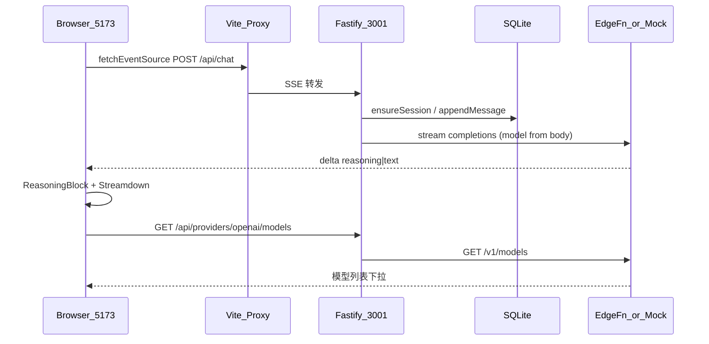

# XX Chat AI — 全栈 AI 聊天方案

> **项目名称**：**XX Chat AI**  
>
> - **GitHub 仓库名**：`xx-chat-ai`（小写 + 连字符，历史仓库名保留）  
> - **XX** — 品牌字符  
> - **Chat** — AI 聊天  
> - **AI** — 大模型对话  
> - 副标题 / README：`Full-Stack AI Chat`（体现前后端全栈）
>
> **样式栈**：shadcn/ui + Tailwind CSS 4 + next-themes

**当前状态**：MVP + Phase 2/3 核心能力均已落地，可本地 `pnpm dev` 验收。

---

## 1. 项目目标

**用户纯文本输入 → SSE 流式推送 → 累加 content / reasoning → 多格式渲染 → 可停止 → 历史对话 → Mock/OpenAI 切换 → 动态选模型**

硬性约束：前端 **React + `@microsoft/fetch-event-source`**。

### 范围（已做 / 不做）

| 已做 | 不做 |
| --- | --- |
| 纯文本输入、SSE 流式、停止生成 | Typewriter 打字机效果 |
| GFM 表格 / 代码 / 图片 / Mermaid / KaTeX 公式 | 多模态上传 |
| 推理块展示（`ReasoningBlock` 折叠） | tool / citation 结构化片段 |
| Mock 关键词意图 + OpenAI 兼容端点 | 代码块全屏（Streamdown 不支持） |
| SQLite 历史 + 侧栏对话列表 | — |
| 图片点击放大预览（自研 Lightbox） | Streamdown 原生图片全屏（不支持） |
| 动态拉取供应商模型列表 | — |
| 用户消息编辑回填输入框 | — |

---

## 2. 技术决策

| 项 | 选择 |
| --- | --- |
| **项目名称** | **XX Chat AI**（GitHub：`xx-chat-ai`，目录 `Interview/xx-chat-ai/`） |
| 定位 | **全栈 AI 聊天** — React 前端 + Fastify 后端 + LLM 流式对话 |
| 结构 | pnpm workspace：`apps/web` + `apps/server` |
| 前端 | Vite 8 + React 19 + TypeScript 6 |
| 后端 | Fastify 5 + TypeScript |
| SSE | `@microsoft/fetch-event-source` + AbortController |
| 状态 | Zustand 5 + persist（`provider` / `model`） |
| Markdown | Streamdown + `@streamdown/code` + `@streamdown/mermaid` + `@streamdown/math` + `@streamdown/cjk` |
| **样式栈** | shadcn/ui + Tailwind CSS 4（`@tailwindcss/vite`） |
| **UI 组件** | shadcn CLI → `components/ui/*`（Button、Input、Sidebar、DropdownMenu、Tooltip…） |
| **图标** | lucide-react；操作图标 18px、发送/停止图标 20px（`size-5`） |
| **主题** | 官网 **Maia + Neutral** preset `b6iJYxYW` + `next-themes` |
| **字体** | Source Sans 3 Variable（init 后实际使用，非 Inter） |
| **视觉** | 简约对话风；全页 `bg-background`；大圆角 `--radius: 1rem` |
| Provider | `DropdownMenu` 切换 Mock / OpenAI（已移除 Switch） |
| 模型 | Header `ModelMenu` 动态下拉（`GET /api/providers/openai/models`） |
| 大模型 | `openai` SDK 流式代理 OpenAI API（兼容协议，可接 edgefn、DeepSeek 等）；配置见 `config.local.json`（gitignore） |
| 存储 | **better-sqlite3**（`apps/server/data/chat.db`，WAL） |
| 运行 | 本地 `pnpm dev`（:5173 + :3001） |

### 明确不做（视觉层）

- 自定义 `gemini.css` / gradient 光斑 / GlassPanel
- 自定义 `@theme` 覆盖 shadcn 色板
- 额外 UI 库（Ant Design、MUI 等）

### shadcn 初始化（已执行）

```bash
cd apps/web
npx shadcn@latest init -t vite -b radix -p b6iJYxYW -y
npx shadcn@latest add button input scroll-area sidebar separator skeleton sheet tooltip dropdown-menu
pnpm add next-themes streamdown @streamdown/code @streamdown/mermaid @streamdown/cjk
```

### 圆角规范（大圆角 · 用户指定）

| Token / 区域 | 值 |
| --- | --- |
| `--radius`（根） | `1rem` |
| Button / Input | `rounded-lg` |
| Streamdown 块级卡片（代码/表格/图片/Mermaid） | 统一 `rounded-lg`（`--radius-lg`） |
| 聊天输入外容器 | 胶囊形 `rounded-full` |
| 发送/停止按钮 | 圆形 `rounded-full`（`size-9`） |
| 停止图标 | 实心圆角小方块 `<span class="size-3.5 rounded-[4px] bg-current" />` |

### 样式抽离约定（`.cursor/rules/ui-styling.mdc`）

- 优先 shadcn 默认 `variant` / `size`，非必要不覆盖原语
- 长 Tailwind class 抽到同级 `ComponentName.styles.ts`：`export const styles = { … } as const`
- 条件样式用 `cn(styles.base, cond && styles.variant)`
- 不用 `@apply` 覆盖 shadcn 原语

---

## 3. UI 布局（已实现）

```
┌─ Sidebar ────┬─ 主区域 ─────────────────────────────────────┐
│ [新建对话]    │ [≡][✎]      XX Chat AI      [模型▾][Mock▾] [🌓] │
│ 历史对话列表  ├──────────────────────────────────────────────┤
│ (hover 删除 / 批量管理)  │                                              │
│              │   空状态：居中「嘻嘻，想问点什么？」+ 快捷标签       │
│              │   有对话：用户右对齐气泡 / AI 全宽 Streamdown    │
│              │          推理中：ReasoningBlock + 等待卡片(三点) │
│              │                                              │
│              │   ╭──────────────────────────────────────╮   │
│              │   │  嘻嘻，想问点什么？              ( ↑ )    │   │
│              │   ╰──────────────────────────────────────╯   │
│              │   底部渐变过渡 + 悬浮输入区                    │
└──────────────┴──────────────────────────────────────────────┘
```

| 区域 | 实现 |
| --- | --- |
| 侧栏 | `AppSidebar` + shadcn `Sidebar`（offcanvas）；「新建对话」居中；历史对话列表；批量选择与删除；`TooltipProvider` 包裹（必须，否则白屏） |
| 顶栏 | `ChatHeader`：左 `SidebarTrigger` + 新建对话；中品牌标题；右 `ModelMenu` + `ProviderMenu` + `ModeToggle` |
| 空状态 | `HomeView`：居中标题 + `ChatComposer` + 快捷标签 |
| 用户消息 | 右对齐 `bg-muted` 圆角气泡；hover 显示编辑（回填输入框）+ 复制 |
| AI 消息 | 全宽 `MarkdownMessage`；可选 `ReasoningBlock`（顶栏文案 + 左侧竖线正文） |
| 等待回复 | 与用户气泡同高的 `bg-muted` 卡片，内三点交替动画（无文案） |
| 输入区 | `ChatComposer` 悬浮底部；支持 `prefillComposer` 回填编辑 |
| Provider | `ProviderMenu`（`outline` 胶囊）；流式中禁用 |
| 模型 | `ModelMenu`（仅 openai）；可搜索过滤 |
| 智能滚动 | 贴底跟随；离开底部显示「回到底部」 |
| 图片 | 点击 → `ImageLightbox` |

### Streamdown 样式覆盖（`index.css`）

| 项 | 做法 |
| --- | --- |
| 块级卡片圆角 | `.prose-message [data-streamdown=code-block\|mermaid-block\|table-wrapper\|image…]` → `--radius-lg` |
| 工具栏图标尺寸 | 统一 `button svg` → `1rem` |
| 工具栏图标垂直居中 | `button:has(>svg)` + `div.relative:has(>button)` → `inline-flex` |
| 工具按钮顺序 | 复制 → 下载 → 全屏（`code-block-copy-button { order: -1 }`） |
| 图片可点预览 | `[data-streamdown="image"] { cursor: zoom-in }` |
| Mermaid 兜底 | `mermaidPlugin` 先原样渲染，失败再 `sanitizeMermaid`；`barChart` 伪语法转 `xychart-beta` |
| 三点等待动画 | `.generating-dot` keyframes（`index.css`） |

> Streamdown 原生：`table`/`mermaid` 有 fullscreen；`code`/`image` 无 fullscreen；图片预览为自研 `ImageLightbox`。

---

## 4. 系统架构



---

## 5. 目录结构（当前）

```
xx-chat-ai/
├── package.json
├── pnpm-workspace.yaml
├── .gitignore                    # 含 apps/server/config.local.json
├── .cursor/rules/                # 项目级 Cursor 规则
│   ├── project.mdc                 # 总览与硬性约束（alwaysApply）
│   ├── plan-sync.mdc               # plan 文档同步约定
│   ├── frontend.mdc                # 前端约定
│   ├── backend.mdc                 # 后端约定
│   └── ui-styling.mdc              # UI 样式抽离
├── apps/
│   ├── web/
│   │   └── src/
│   │       ├── App.tsx           # SidebarProvider + TooltipProvider
│   │       ├── App.styles.ts
│   │       ├── components/
│   │       │   ├── ui/           # shadcn
│   │       │   ├── theme-provider.tsx
│   │       │   ├── mode-toggle.tsx + .styles.ts
│   │       │   └── chat/
│   │       │       ├── AppSidebar.tsx + .styles.ts
│   │       │       ├── ChatHeader.tsx + .styles.ts
│   │       │       ├── ChatComposer.tsx + .styles.ts
│   │       │       ├── HomeView.tsx + .styles.ts
│   │       │       ├── MessageList.tsx + .styles.ts
│   │       │       ├── MessageItem.tsx + .styles.ts
│   │       │       ├── ReasoningBlock.tsx + .styles.ts
│   │       │       ├── MarkdownMessage.tsx + .styles.ts
│   │       │       ├── ImageLightbox.tsx + .styles.ts
│   │       │       ├── ProviderMenu.tsx + .styles.ts
│   │       │       └── ModelMenu.tsx + .styles.ts
│   │       ├── lib/
│   │       │   ├── chat-types.ts
│   │       │   ├── mermaidPlugin.ts | sanitizeMermaid.ts | mathPlugin.ts
│   │       ├── stores/chatStore.ts
│   │       ├── services/sseClient.ts | historyApi.ts | providerApi.ts
│   └── server/
│       ├── config.local.example.json   # 模板（进仓库）
│       ├── config.local.json           # 真实 Key（gitignore，不进仓库）
│       ├── data/chat.db                # SQLite（gitignore）
│       └── src/
│           ├── index.ts
│           ├── config/local.ts
│           ├── lib/
│           │   ├── thinkingParser.ts   # 流式思考标签 → reasoning/text
│           │   └── reasoningDelta.ts   # delta 多字段推理归一化
│           ├── providers/
│           │   ├── mock.ts             # 关键词意图 mock
│           │   ├── openai.ts           # SDK 流式 + models.list
│           │   ├── config.ts           # provider 可用性
│           │   └── index.ts
│           ├── routes/
│           │   ├── chat.ts
│           │   ├── history.ts
│           │   └── providers.ts
│           └── store/
│               ├── history.ts          # 接口 + 内存回退
│               └── sqlite.ts           # SqliteHistoryStore
```

**已删除组件**：`ProviderSwitch`、`EmptyState`、`card`、`badge`、`switch`、`label`（改用 DropdownMenu + 精简依赖）。

---

## 6. API

### 聊天 SSE

`POST /api/chat`

```json
{
  "query": "你好",
  "sessionCode": "optional-uuid",
  "provider": "mock | openai",
  "model": "optional-override",
  "messages": [{ "role": "user|assistant", "content": "..." }]
}
```

事件：`meta` → `delta`* → `done` | `error`；客户端 AbortController 停止时服务端持久化**已生成的正文**（不含推理块）。

**delta 载荷**（2026-07 扩展）：

```ts
{ type: 'reasoning' | 'text', content: string }
```

- `reasoning`：思考过程，仅当前轮展示，**不落库、不回传**上游 API。
- `text`：最终回答，累加写入 SQLite `messages.content`。

**Provider 推理归一化**（`openai.ts` + `lib/`）：

1. 优先 `delta.reasoning_content` / `reasoning` / `thinking` / `thinking_content` / `thinking_blocks`
2. 否则对 `content` 做流式标签解析（`think`、`redacted_thinking`、`reasoning`、`cot` 等）
3. 普通模型无推理字段时全部当 `text`

系统提示要求数值图用 `xychart-beta`，禁止 `barChart`。

### 历史

界面文案统一用 **对话**（不用「会话」）。默认标题 fallback：`新建对话`。

| 方法 | 路径 | 说明 |
| --- | --- | --- |
| GET | `/api/history` | 对话列表（按 `updatedAt` 降序） |
| GET | `/api/history/:sessionCode` | 对话详情 + messages（仅正文） |
| DELETE | `/api/history/:sessionCode` | 删除对话（级联消息） |
| POST | `/api/history/batch-delete` | 批量删除，`{ sessionCodes: string[] }` |

### Provider / 模型

| 方法 | 路径 | 说明 |
| --- | --- | --- |
| GET | `/api/providers` | `{ defaultProvider, defaultModel, providers[] }` |
| GET | `/api/providers/openai/models` | 代理供应商 `/v1/models`，过滤对话模型，缓存 10min |

### Mock 关键词意图

| 关键词 | 响应格式 |
| --- | --- |
| 表格/对比/SSE/WebSocket | GFM 表格 |
| 防抖/节流/代码/typescript | 代码块 |
| mermaid/流程图 | Mermaid 图 |
| 其他 | 多格式 showcase（表+码+图+Mermaid） |

---

## 7. 配置与安全

### 推荐：`config.local.json`（不进 Git）

```bash
cp apps/server/config.local.example.json apps/server/config.local.json
# 编辑 apiKey / baseURL / model / defaultProvider
```

```json
{
  "defaultProvider": "openai",
  "openai": {
    "apiKey": "sk-xxx",
    "baseURL": "https://api.openai.com/v1",
    "model": "gpt-4o"
  }
}
```

**读取优先级**：环境变量 `OPENAI_*` > `config.local.json`  
**不使用** 项目内 `.env` 自动加载（已移除 `dotenv`）；生产用部署平台 Secret 注入环境变量。

| 变量 / 字段 | 说明 |
| --- | --- |
| `OPENAI_API_KEY` | API Key |
| `OPENAI_BASE_URL` | API 端点（OpenAI 兼容，如 edgefn、DeepSeek、OpenAI 官方） |
| `OPENAI_MODEL` | 默认模型（可被前端下拉覆盖） |
| `OPENAI_SYSTEM_PROMPT` | 可选系统提示 |
| `DEFAULT_PROVIDER` | `mock` \| `openai` |
| `PORT` | 默认 3001 |
| `DB_PATH` | 可选 SQLite 路径 |

---

## 8. 实现阶段（进度）

### Phase 1 — MVP ✅

- [x] Monorepo + shadcn Maia/Neutral + next-themes
- [x] Fastify SSE + Mock 多格式流（关键词意图）
- [x] 聊天 UI + fetchEventSource + Streamdown
- [x] AbortController 停止

### Phase 2 — 体验 ✅

- [x] 贴底智能滚动 + 「回到底部」按钮（过渡动画 + 防闪烁）
- [x] SQLite 历史 + Sidebar 对话列表（新建/切换/删除/批量）
- [x] 聊天 UI + 样式抽离 + Streamdown 卡片/toolbar 统一
- [x] 图片点击放大 `ImageLightbox`

### Phase 3 — 真实模型 ✅

- [x] `openai` SDK 流式代理（OpenAI API，兼容端点）
- [x] `config.local.json` 本地私有配置
- [x] `GET /api/providers` 可用性探测
- [x] `GET /api/providers/openai/models` 动态模型列表
- [x] Header `ProviderMenu` + `ModelMenu` 运行时切换
- [x] 401/404/429 等错误中文提示

### Phase 4 — 推理与体验增强 ✅

- [x] 推理块分离：SSE `reasoning` / `text` + `ReasoningBlock` 折叠 UI
- [x] `thinkingParser` + `reasoningDelta` 多厂商兼容（字段优先 + 标签兜底）
- [x] 历史仅存正文；多轮上下文不回传推理
- [x] KaTeX 数学（`@streamdown/math`）
- [x] Mermaid `barChart` 自动转 `xychart-beta`
- [x] 用户消息编辑回填；等待回复三点动画卡片
- [x] 界面文案：统一「对话」；「新建对话」

---

## 9. 本地启动

```bash
cd xx-chat-ai
pnpm install
# 配置 API（首次）
cp apps/server/config.local.example.json apps/server/config.local.json
pnpm dev
```

- 前端：http://localhost:5173
- 后端：http://localhost:3001
- 健康检查：`GET /api/health`
- Provider 状态：`GET /api/providers`

### 构建

```bash
pnpm build   # web + server
```

### 已知问题与修复记录

| 问题 | 修复 |
| --- | --- |
| SSE 流提前断开 | `reply.raw.on('close')` 替代 `request.raw.on('close')` |
| 侧栏有历史对话后白屏 | 根节点补 `TooltipProvider`（Sidebar tooltip 依赖） |
| 工具栏图标不齐/顺序乱 | `index.css` flex 居中 + `order:-1` 统一复制优先 |
| 回到底部按钮闪烁 | `jumpingRef` 防止平滑滚动中间帧重新显示 |
| Mermaid `barChart` 报错 | `convertInvalidBarChart` → `xychart-beta` |
| edgefn R1 无 `reasoning_content` | `content` 内 `redacted_thinking` 标签流式解析 |

**待修复 Bug 排期**：见 [`docs/bugs-plan.md`](./bugs-plan.md)（2026-07 代码审查录入，尚未改代码）。

---

## 10. Agent Skills（可选）

已安装至 `.agents/skills/`（`pnpm dlx skills add shadcn/ui`）：

- `shadcn` — 组件添加/调试/样式
- `migrate-radix-to-base` — Radix → Base UI 迁移参考
